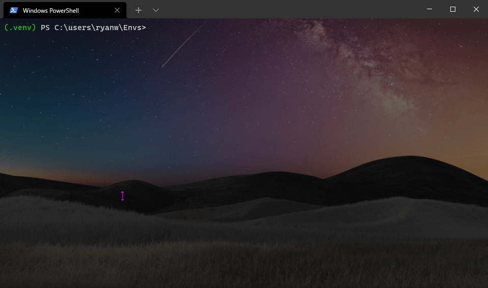
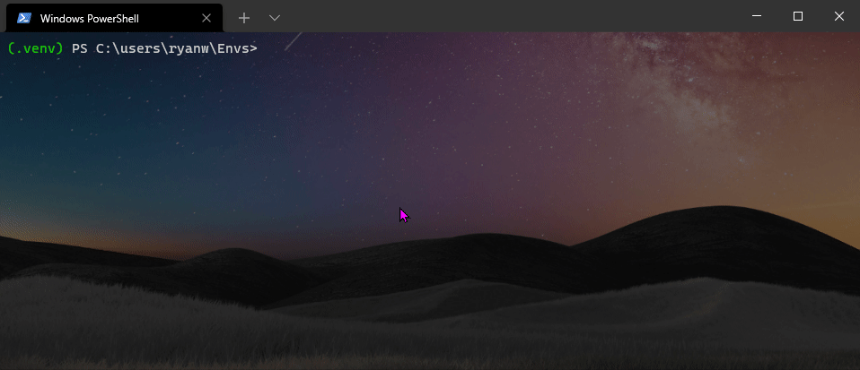

<p align="center">
    
</p>


[](https://github.com/ryanwarrick)


# Spotify-Playlist-Utility

Spotify-Playlist-Utility is a Python command-line utility to archive, restore, & shuffle Spotify playlists.

Spotify's service has a few feature gaps. Fortunately, they offer a fairly nice Web API. To fill in these gaps, I developed a Python cmd-line utility that offers the following features:
* Export: Spotify Saved (Liked) Tracks -> CSV track listing
* Export: Spotify Playlist -> CSV track listing
* Import: CSV track listing -> Spotify Playlist
* List: Spotify Playlists (name & track count)

## Project Context:

Long ago, I informally self-taught myself Python in a mostly hobby capacity. As my cybersecurity/IT career has progressed, I've worked to formalize my Python skills so that I could write compliant, well-documented, ready for open-source, and packaged/deployable Python packages.

I used this project idea as an opportunity to build out a full-fledged Python project repo.

For example, this project...
* has a package with various modules within it
* is easily distributable: .tar.gz/.whl support and on the Python Package Index (PyPI/pip)
* has sphinx auto-generated docs documenting classes/functions
* includes .vscode configs for easy development in VS Code
* config file support
* command-line application with argument support
 
## Installation 

Prerequisite: System must have Python 3.6+ installed (and pip - included with Python). See [Python docs here](https://wiki.python.org/moin/BeginnersGuide/Download) for help installing.

Next, run the following pip command in the terminal to install the package from the Python Package Index:
```
python -m pip install spotify-playlist-utility
```


## Setup/Configuration

This script interacts with Spotify's Web API via the [spotipy](https://github.com/plamere/spotipy) open-source Python library. Therefore, we must register an application with Spotify's developer site and add the necessary data to a configuration file.

### Steps: 
1) To get started using the API, create an app on [Spotify's developer site](https://developer.spotify.com/dashboard/).
    * Log in with your Spotify account credentials.
    * Click "Create an App"
    * Provide an app name/description and click "Create".
    * On the following page, click "Edit Settings".
    * Add "http://localhost:8888/callback" to the "Redirect URIs", click "add" then "save".
    * Take note of the "Client ID" and "Client Secret" on the Application Overview page.
2) Create a customized configuration file for use by the package's 'spotify-playlist-utility' console command:
    * Download a copy of the [template configuration file ('config.ini') ](https://github.com/ryanwarrick/spotify-playlist-utility/blob/master/config.ini) found  at the project root.
        * (Note: If you are working from source, you can grab the same file from your clone of the repo)
    * Edit the file to overwrite the placeholder values with the 'Client ID' and 'Client Secret' we previously noted in Step 1. You can leave 'RedirectURI' unmodified. See the example below...

```
[DEFAULT]
ClientID = ABCDEFGHI
ClientSecret = 123456789
RedirectURI = http://localhost:8888/callback
```

## Usage/Examples

For help, execute the following in the console
```
spotify-playlist-utility --help
```
### Export Spotify Playlist Tracks (to .csv file)
```
spotify-playlist-utility <config_ini_file_path> -p <output_csv_file_path>
```


### Import Tracks to Spotify Playlist (from matching .csv file)
```
spotify-playlist-utility <config_ini_file_path> -i <input_csv_file_path>
```


### Shuffle Spotify Playlist Tracks
```
spotify-playlist-utility <config_ini_file_path> -z
```


# Files Not in Change Management (Manual Backups Required)
Some files within projects are not controlled by change management as specified by the .gitignore config because they contain sensitive data, therefore it's not appropriate to sync them to a change management repository.

Sensitive files:
* <project_root>/my_config.ini (spotify user-specific credentials)

To avoid data loss of these files that aren't Git tracked, make sure to backup these files to a different location, as appropriate.
  
# Contributors

- Development: [@ryanwarrick - Github](https://www.github.com/ryanwarrick)
- Logo Asset: [@UniTheDino - Twitter](https://twitter.com/unithedino)